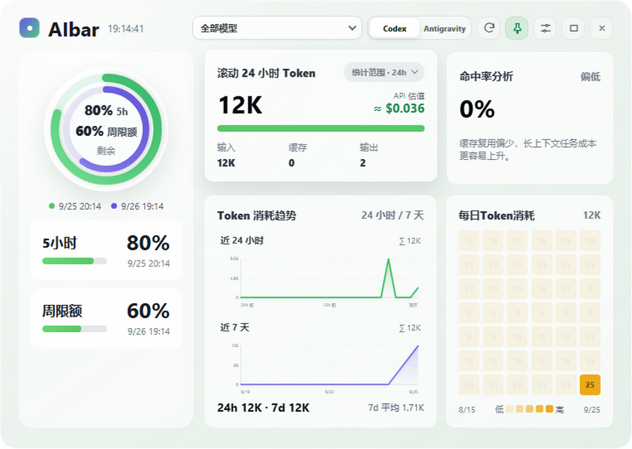
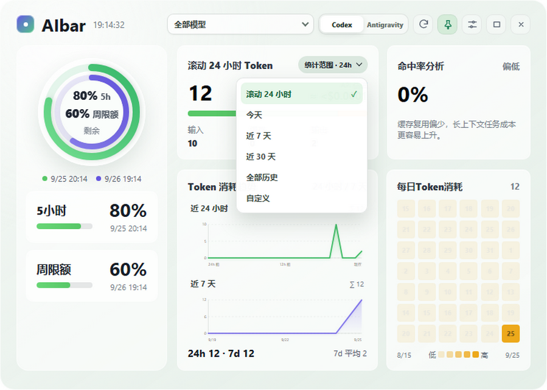
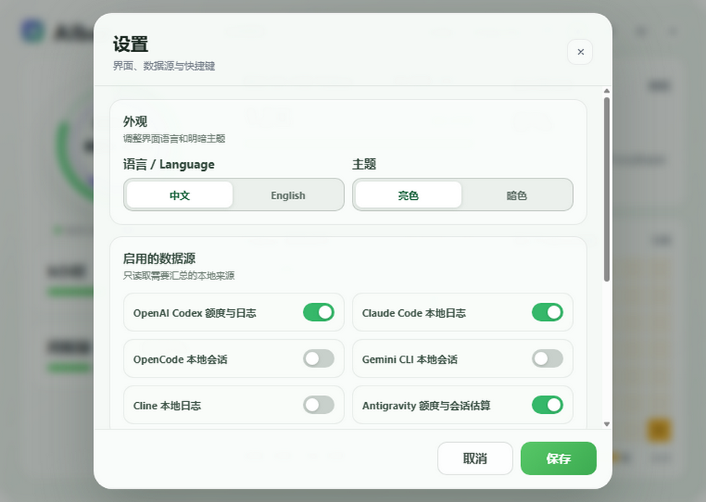
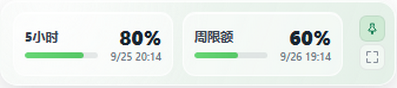
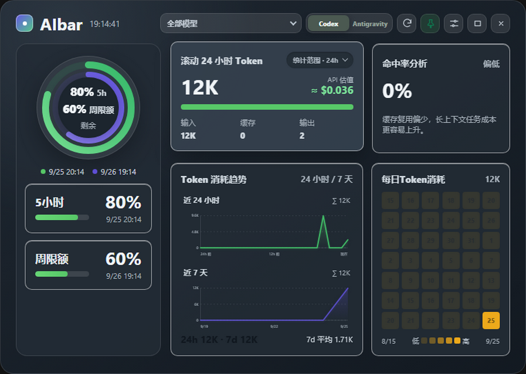

# AI 额度（AI Quota Widget）

一个常驻桌面的 Windows 悬浮窗，用于查看 Codex 额度，以及 Codex、Claude Code、OpenCode、Gemini CLI、Cline 和 Antigravity 的本地 Token 用量。界面支持完整的中英文切换。

[English](README_EN.md) · [下载发行版](https://github.com/w1ndmiIl/ai-quota-widget/releases)

## 界面

以下截图来自 v1.5.2 实际渲染界面，使用模拟额度和 Token 数据，不代表你的账号用量。点击图片可查看原图。

### 总览与统计范围

[](docs/images/v1.5.2/zh-overview.png)

[](docs/images/v1.5.2/zh-range-picker.png)

统计范围放在 Token 卡片内，提供滚动 24 小时、今天、近 7 天、近 30 天、全部历史及自定义日期。切换范围会更新用量卡片和对应趋势，不改变额度读数。

### 外观与紧凑模式

[](docs/images/v1.5.2/zh-settings.png)

[](docs/images/v1.5.2/zh-compact.png)

[](docs/images/v1.5.2/zh-dark.png)

## 主要功能

- 通过本机 Codex `app-server` 读取当前账号额度和重置时间。
- Antigravity 运行时每 5 分钟自动读取 Gemini 模型共享的 5h 与周额度；未运行时仅在用户点击刷新后短暂启动官方后台服务，读取完成即退出。
- 展示重置卡数量、状态和到期时间。
- 统计本机 Codex、Claude Code、OpenCode、Gemini CLI 和 Cline 会话中的 Token 用量。
- 按模型公开的标准文本 API 单价估算 Token 的美元价值（不等同于订阅账单）。
- 根据本机 Antigravity 会话估算 Gemini 模型的 Token 用量；外部模型不纳入统计，该数据不是官方账单。
- 提供模型筛选、趋势图、每日热力图和可用数据源的缓存命中率。
- 支持完整的中英文界面、亮色与暗色主题。
- 支持托盘运行、窗口置顶、`336 × 72` 紧凑模式和单实例运行。
- 支持自定义显示面板、紧凑模式、刷新和置顶快捷键。

### 支持的数据源

| 数据源 | 读取方式 |
| :--- | :--- |
| Codex | 本地 `app-server` 额度与会话 JSONL |
| Claude Code | 本地项目会话 JSONL |
| OpenCode | 本机 OpenCode CLI 的统计与脱敏会话导出 |
| Gemini CLI | `~/.gemini/tmp/<project>/chats/` 中的会话 Token 摘要 |
| Cline | VS Code 系列全局存储与 `~/.cline/data` 中的任务日志 |
| Antigravity | 短暂启动官方后台服务读取 Gemini 5h/周额度，并从本地会话转录估算 Token |

OpenCode 需要本机安装 CLI；Gemini CLI 读取会话中的 Token 摘要；Cline 支持 VS Code、VS Code Insiders、VSCodium、Cursor、Windsurf 和 Cline CLI 的常见数据目录。

### 应用架构

| 层级 | 职责 |
| :--- | :--- |
| `main.js` | Electron 生命周期、窗口/托盘、快捷键和 IPC 编排 |
| `app-config-store.js` / `dashboard-snapshot-store.js` | 配置与仪表盘快照持久化 |
| `usage-coordinator.js` / `usage-worker-client.js` | 用量缓存、请求合并及 worker 生命周期 |
| `usage-worker.js` 与各 Agent service | 在线程中扫描和聚合本地会话 |
| `renderer.js` / `model-usage.js` | 原有界面交互、图表渲染与模型聚合 |
| `dashboard-controls.js` / `report-view.js` | 统计范围菜单与所选范围的趋势数据 |

可见窗口中的历史数据每分钟刷新一次，usage worker 会跨越该周期复用；窗口隐藏后仍会按原有策略释放 worker 和 Codex 子进程。模型菜单只在结构或选择实际变化时重建。

Codex 与 Claude 的当前用量、历史和累计视图共用短期事件缓存。OpenCode 使用异步导出，合并并发查询并分批更新；额度与 Token 数据分别到达、分别显示，读取失败时保留上次有效结果。紧凑模式只刷新额度，暂停不可见图表和 Token 查询，展开后补充刷新。

仪表盘快照会合并连续保存请求，并通过临时文件替换完成落盘；正常退出会等待待写快照，最长等待 2 秒。

默认快捷键：

- `Ctrl+Shift+Space`：显示或隐藏主面板
- `Ctrl+Shift+M`：切换紧凑模式

## 使用说明

1. 从 [Releases](https://github.com/w1ndmiIl/ai-quota-widget/releases) 下载 Windows 安装包。
2. 如需查看 Codex 官方额度，请先安装并登录 Codex 桌面端。
3. 启动 AI 额度；程序会自动查找本机 `codex.exe`，无需手动填写路径。

Codex 未安装或未登录时，其他已启用 Agent 的本地用量统计仍可使用，Codex 额度区域会显示读取失败。未安装或未使用某个数据源时，对应统计为空是正常现象。

程序只读取当前用户的本地会话文件。OpenCode 会话通过官方 CLI 的只读脱敏导出解析；Gemini CLI 和 Cline 仅提取 Token、模型与时间字段。会话正文不会写入 AI 额度缓存；配置和用量缓存优先保存在程序目录下的 `.userdata` 文件夹中；目录不可写时使用系统用户数据目录。

界面的 HTML、CSS 与 JavaScript 只在窗口启动时加载一次；运行中按需刷新额度和本地日志数据。隐藏到托盘后会停止界面刷新，并在空闲后释放日志扫描线程与本应用启动的 Codex 子进程。

## 统计范围与历史

- 统计范围支持滚动 24 小时、今天、近 7 天、近 30 天、全部历史和自定义日期；自定义结束日期包含当天。
- 模型菜单继续列出完整历史模型，并按累计用量排序；Token 卡片显示当前选择范围内的用量。
- 默认保留原来的近 24 小时和近 7 天双趋势图；选择其他范围时，下方趋势图显示该范围。热力图沿用原布局，最多展示区间末尾 42 天。
- 历史账本保留已结算记录。恢复的 Gemini 历史估算记录在重新扫描后仍会保留，并避免重复计数。
- 绿色版日常使用固定的程序目录；手动迁移时应连同整个 `.userdata` 一起迁移。安装包升级会备份并恢复数据目录。

## 本地开发

需要 Node.js 22.12 或更高版本，桌面运行时为 Electron 44.3.0。

```powershell
npm ci
npm start
npm run check
npm run test:ui
```

构建 Windows 绿色版：

```powershell
npm run build:win
```

构建 Windows 安装包：

```powershell
npm run release:win
```

构建结果位于 `release/`。版本变化见 [CHANGELOG.md](CHANGELOG.md)。
重复构建绿色版时，构建脚本会自动保留 `release/win-unpacked/.userdata` 中的设置与缓存。安装包升级会先在旧安装目录旁建立 `.ai-bar-data-backup` 备份，再恢复 `.userdata`；升级完成后保留该备份供恢复。
构建与发布命令会先执行 JavaScript 语法检查、全部单元测试和隔离 Electron UI 测试，检查失败时停止打包；完成后核对归档源码，并在 CI 验证安装启动与升级配置保留。GitHub Actions 在 Windows 的 Node.js 22 和 24 环境运行同一检查；构建缓存默认放在项目的 `.cache/electron-builder` 中。

## 项目结构

```text
src/      应用源码
test/     自动化测试
docs/     文档图片
scripts/  构建脚本
```

## 许可证

[MIT](LICENSE)
