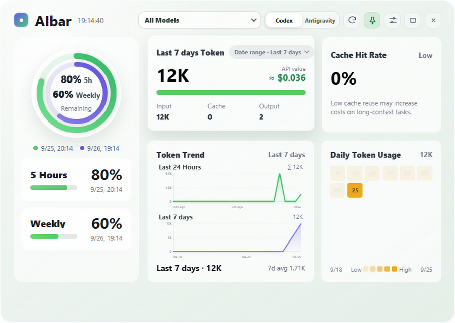
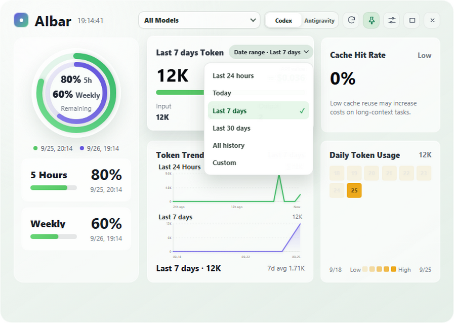
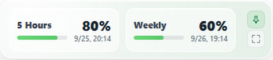

# AI Quota Widget

A Windows desktop widget for viewing Codex quota and local token usage from Codex, Claude Code, OpenCode, Gemini CLI, Cline, and Antigravity, with complete Chinese and English interfaces.

[中文](README.md) · [Download](https://github.com/w1ndwill/ai-quota-widget/releases)

## Screenshots

These screenshots come from the v1.5.2 renderer with simulated quota and token data; they do not represent your account. Click an image to view it at full size.

### Dashboard and date range

[](docs/images/v1.5.2/en-overview.png)

[](docs/images/v1.5.2/en-range-picker.png)

The token card offers a rolling 24-hour range, today, 7 or 30 days, all history, and custom dates. Changing the range updates usage and trend data while quota readings stay in place.

### Compact view

[](docs/images/v1.5.2/en-compact.png)

## Features

- Reads the current account quota and reset time from the local Codex `app-server`.
- Refreshes the shared Gemini 5-hour and weekly quota every five minutes while Antigravity is running; when it is closed, only an explicit refresh briefly starts the official background service and then exits.
- Shows reset-card counts, status, and expiry details.
- Calculates token usage from local Codex, Claude Code, OpenCode, Gemini CLI, and Cline sessions.
- Estimates the USD value of tokens from each model's public standard text API rates (not a subscription bill).
- Estimates Gemini-model token usage from local Antigravity sessions; external models are excluded and this is not official billing data.
- Provides model filters, trend charts, a daily heatmap, and cache-hit rates where available.
- Provides complete Chinese and English interfaces with light and dark themes.
- Supports tray operation, always-on-top, a `336 × 72` compact mode, and single-instance startup.
- Supports configurable shortcuts for panel visibility, compact mode, refresh, and always-on-top.

### Supported data sources

| Source | Read method |
| :--- | :--- |
| Codex | Local `app-server` quota and session JSONL |
| Claude Code | Local project-session JSONL |
| OpenCode | Local OpenCode CLI statistics and sanitized session exports |
| Gemini CLI | Session token summaries under `~/.gemini/tmp/<project>/chats/` |
| Cline | Task logs in VS Code-family global storage and `~/.cline/data` |
| Antigravity | Short-lived official background service for Gemini 5h/weekly quota, plus local transcript estimates |

OpenCode requires its local CLI. Gemini CLI contributes session token summaries. Cline covers common data locations for VS Code, VS Code Insiders, VSCodium, Cursor, Windsurf, and Cline CLI.

### Application architecture

| Layer | Responsibility |
| :--- | :--- |
| `main.js` | Electron lifecycle, window/tray behavior, shortcuts, and IPC orchestration |
| `app-config-store.js` / `dashboard-snapshot-store.js` | Configuration and dashboard-snapshot persistence |
| `usage-coordinator.js` / `usage-worker-client.js` | Usage caches, request coalescing, and worker lifecycle |
| `usage-worker.js` and Agent services | Local-session scanning and aggregation off the main thread |
| `renderer.js` / `model-usage.js` | Original UI interaction, charts, and model aggregation |
| `dashboard-controls.js` / `report-view.js` | Date-range menu and trend data for the selected range |

While the window is visible, the usage worker is reused across the one-minute history refresh cadence. Hiding the window still releases the worker and Codex subprocess under the existing idle policy. The model menu is rebuilt only when its structure or selection actually changes.

Codex and Claude current, historical, and cumulative views share a short-lived event cache. OpenCode exports run asynchronously, share concurrent requests, and publish results in batches. Quota and token data update independently; failed reads retain the last valid values. Compact mode refreshes quota only and pauses hidden charts and token queries until the panel expands.

Consecutive dashboard saves are coalesced and written through an atomic file replacement. Normal shutdown waits up to two seconds for pending snapshot writes.

Default shortcuts:

- `Ctrl+Shift+Space`: show or hide the main panel
- `Ctrl+Shift+M`: toggle compact mode

## Getting started

1. Download the Windows installer from [Releases](https://github.com/w1ndwill/ai-quota-widget/releases).
2. To view official Codex quota, install and sign in to the Codex desktop app first.
3. Start AI Quota Widget. It finds the local `codex.exe` automatically.

If Codex is unavailable, local usage statistics from other enabled agents still work while the Codex quota area reports a read failure. An unused or unavailable data source simply has no usage data.

The application reads session files for the current user only. OpenCode sessions are parsed through the official CLI's read-only sanitized export; Gemini CLI and Cline readers only extract token, model, and time fields. Transcript text is not written to the widget cache. Settings and usage caches are stored in the `.userdata` folder beside the application.

The UI's HTML, CSS, and JavaScript load once when the window starts. While running, only quota and local-log data are refreshed as needed. Hiding the app to the tray pauses UI refreshes and releases the log worker and app-managed Codex subprocess after an idle period.

## Date ranges and history

Choose rolling 24 hours, today, 7 / 30 days, all history or custom calendar dates. The model menu retains the complete historical catalog ranked by cumulative usage; the token card uses the selected range. The default 24-hour and seven-day charts remain, while other ranges use the lower chart. Heatmaps show at most the last 42 days of the range.

Recovered Gemini estimates survive later rescans without double-counting. Keep the complete `.userdata` directory when moving a portable installation; the installer backs it up and restores it during an upgrade.

## Development

Node.js 22.12 or newer is required (Electron 44.3.0).

```powershell
npm ci
npm start
npm run check
npm run test:ui
```

Build the unpacked Windows application:

```powershell
npm run build:win
```

Build the Windows installer:

```powershell
npm run release:win
```

Build artifacts are written to `release/`. See [CHANGELOG.md](CHANGELOG.md) for version history.
When rebuilding the unpacked app, the build script preserves settings and caches in `release/win-unpacked/.userdata`. During an upgrade, the installer backs up `.userdata` beside the old installation in a `.ai-bar-data-backup` directory, restores it after installation, and keeps the backup for recovery.
Build and release commands run JavaScript syntax checks and the full test suite before packaging. GitHub Actions runs the same checks on Windows with Node.js 22 and 24. The default builder cache is `.cache/electron-builder` inside the project.

## Project structure

```text
src/      Application source
test/     Automated tests
docs/     Documentation images
scripts/  Build scripts
```

## License

[MIT](LICENSE)
